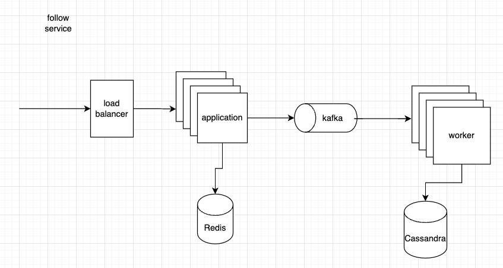

# Follow Service

## 功能
1. 關注和取消關注功能
2. 採取分頁方式返回粉絲清單、關注列表、好友列表(互相關注)。

## 系統架構


## 程式碼架構
```text
.
├── cmd/
│   ├── rpc/
│   └── worker/
├── database/
├── delivery/
│   ├── rpc/
│   └── worker/
├── doc/
├── pkg/
└── service/
    ├── model/
    ├── repository/
    └── usecase
```

- entry point(rpc)：rpc 接口的進入點，提供給其他服務使用（proto 檔尚未建置）。
- entry point(worker)：worker 的進入點，作為 kafka 的 consumer。
- database：db 的 init schema 以及 migration 放置處。
- delivery：整合 service 的層級，以及對外的交互介面會放在此處。
- service：專門用來放置核心邏輯的地方。

## 專案說明

### rpc
接口以及 parameter, response 可查閱 [follow.proto](./protos/follow.proto) 檔案

### worker
